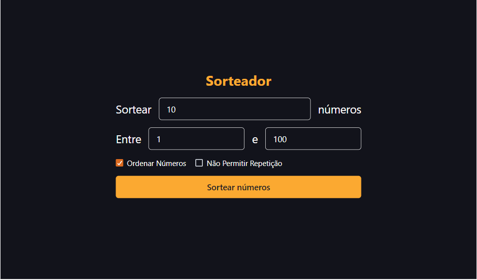
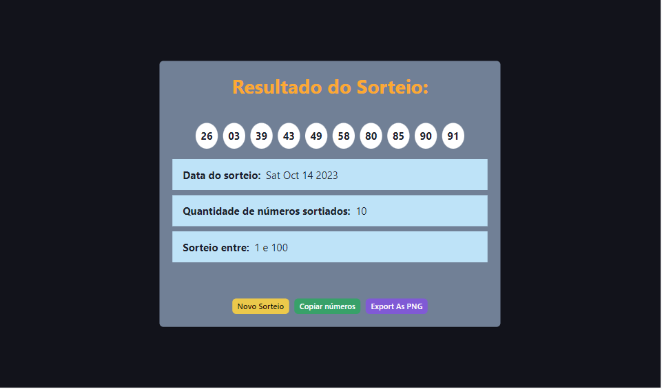

<div align="center">
  <h1>Sorteador de números</h1>
</div>

<div align="center">
  
  
</div>

Aplicação para sortear números.

## ✔️ Técnicas e tecnologias utilizadas

Lista de tecnologias que foram usadas nesse projeto:


### 🚧 Outras Bibliotecas utilizadas

* [react-icons](https://react-icons.github.io/react-icons/)
* [react-toastify](https://www.npmjs.com/package/react-toastify)
* [react-component-export-image](https://www.npmjs.com/package/react-component-export-image)

## 🛠️ Abrir e rodar o projeto

Para abrir e rodar o projeto, entre na pasta do projeto e execute ```npm install``` para instalar as dependências e ```npm start``` para iniciar o projeto.

Depois, acesse <a href="http://localhost:3000/">http://localhost:3000/</a> no seu navegador.

### 🚧 Projeto em produção
Este projeto pode ser visualizado neste [link](https://sorteador-de-numeros-cbzbrgl9l-grazziano.vercel.app/).

## 📚 Mais informações

Entre em contato pelo [linkedin](https://www.linkedin.com/in/grazziano-fagundes/).

<div align="center">
  <small>Grazziano Borges Fagundes - 2023</small>
</div>
